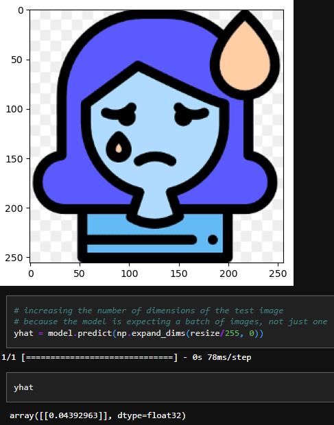
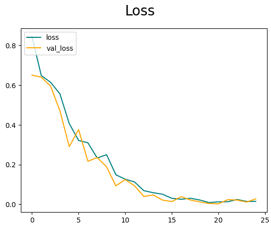

# Cheer Checker
This project is a happy and sad image classifier using Convolutional Neural Networks (CNNs). It aims to distinguish between happy and sad images by analyzing their visual features and patterns.

# Languages and Frameworks/Libraries
The project is implemented using the following languages and frameworks/libraries:

* **Python**
* **TensorFlow**
* **OpenCV**
* **Matplotlib**

# Installation and Execution
To install and run the project locally, follow these steps:
1. Clone the repository
2. Navigate to the project directory
3. Install the required dependencies
```
pip install tensorflow opencv-python matplotlib
```
4. Run the notebook or execute each cell individually, as you'd like.

# Configuration
1. The project automatically removes dodgy images (images with invalid extensions) from the dataset.
2. The dataset is then preprocessed by scaling the images from the range 0-255 to the range 0-1.
3. The preprocessed dataset is split into training, validation, and test sets for model training and evaluation.
4. The CNN model is built using the Sequential API from TensorFlow. It consists of convolutional layers, max pooling layers, and dense layers.
5. The model is trained using the Adam optimizer and Binary Crossentropy loss function. The training process can be monitored using TensorBoard logs.
6. After training, the performance of the model is evaluated using precision, recall, and accuracy metrics.
7. The trained model can be used for testing by providing an input image. The model predicts whether the image depicts a happy or sad person.
8. The model can be saved and loaded for future use.

# Snapshots
## Model Classifying a Sample Image


## Loss and Validation Loss Graph During Model Training


# Conclusion
This project demonstrates the use of Convolutional Neural Networks (CNNs) for classifying happy and sad images. By training the model on a dataset of happy and sad images, it learns to recognize the visual patterns associated with each emotion. The trained model achieves high accuracy in distinguishing between happy and sad images. Feel free to explore and modify the project to suit your needs.
